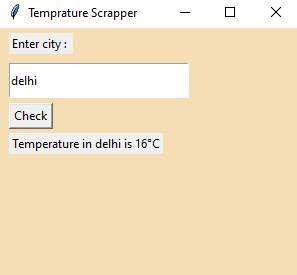

# Temperature-Scrapper
This is a temperature scrapper which scrapes temperature of whatever city you feed it. 

Libraries I have used :
1. requests
2. tkinter
3. BeautifulSoup

Used tkinter to make GUI for this.

